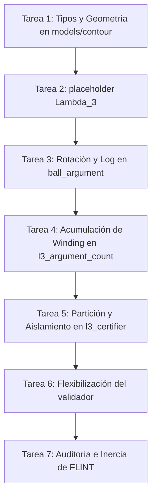

# Experimento 006E3: Plan TDD de Integración Inerte del Principio del Argumento L3

## 1. Estado Heredado

El proyecto cuenta con un marco estructural validado en la fase 006E (37 pruebas sintéticas en verde), pero mantiene la integración real del backend FLINT bloqueada debido a que el principio del argumento riguroso para $L(s, \chi_3)$ no estaba especificado de forma inequívoca. 

La fase 006E2 fijó las bases teóricas y matemáticas (método de principio del argumento puro, exclusión de la función de Hardy para la generación de candidatos y desestimación del método de Turing para L3). 

Este plan de prueba unitaria previa al código (TDD) define el camino de transición desde el código sintético actual hacia una arquitectura de tipos exacta e inerte que cumpla con 006E2.

---

## 2. Alcance y Prohibiciones

El alcance de la fase 006E3 es **estrictamente de diseño de pruebas unitarias y definición de interfaces e implementaciones inertes**. 

```text
status = tdd_plan_only
purpose = inert_integration_plan
code_authorization = false
execution_authorization = false
real_flint_execution = forbidden
zero_tables = not_generated
artifacts = none
```

### Prohibiciones absolutas durante esta fase:
*   No modificar ni crear código fuente ejecutable en la biblioteca principal o tests.
*   No importar la biblioteca `flint` real en tiempo de ejecución.
*   No evaluar funciones L complejas sobre contornos con precisión real.
*   No calcular ceros ni generar tablas de raíces.
*   No realizar escrituras de archivos bajo la carpeta `artifacts/`.
*   No declarar la certificación H2 como completada.
*   No preparar ni habilitar la fase de ejecución real 006F.

---

## 3. Lista Exacta de Archivos a Crear/Modificar

Para separar de forma limpia las responsabilidades y cumplir con la arquitectura diseñada, se proponen las siguientes rutas de archivos:

### A. Archivos a Crear (Nuevos):
1.  [completed_l3.py](file:///c:/Users/johnn/Documents/El%20Nacimiento%20del%20Espacio/athena_azr/h2_zero_certifier/completed_l3.py): Definición simbólica/inerte de la función completada $\Lambda_3(s)$.
2.  [contour.py](file:///c:/Users/johnn/Documents/El%20Nacimiento%20del%20Espacio/athena_azr/h2_zero_certifier/contour.py): Geometría exacta de contornos basada en coordenadas racionales o decimales.
3.  [ball_argument.py](file:///c:/Users/johnn/Documents/El%20Nacimiento%20del%20Espacio/athena_azr/h2_zero_certifier/ball_argument.py): Lógica de rotación de semiplanos complejos y acotación de incrementos angulares de fase.
4.  [l3_argument_count.py](file:///c:/Users/johnn/Documents/El%20Nacimiento%20del%20Espacio/athena_azr/h2_zero_certifier/l3_argument_count.py): Integración del contorno completo, acumulación de winding numbers y determinación de unicidad entera.
5.  `tests/test_h2_completed_l3.py`: Pruebas unitarias de la estructura $\Lambda_3(s)$ sintética.
6.  `tests/test_h2_contour.py`: Pruebas de construcción, clausura y orientación positiva de rectángulos exactos.
7.  `tests/test_h2_ball_argument.py`: Pruebas de exclusión del origen y rotación de imágenes de segmentos.
8.  `tests/test_h2_l3_argument_count.py`: Pruebas sintéticas de winding numbers de contorno con raíces conocidas.
9.  `tests/test_h2_l3_isolation.py`: Pruebas de partición recursiva y bisección en el plano complejo sin utilizar Hardy.

### B. Archivos a Modificar:
1.  [models.py](file:///c:/Users/johnn/Documents/El%20Nacimiento%20del%20Espacio/athena_azr/h2_zero_certifier/models.py): Agregar tipos geométricos inmutables del dominio (`RationalComplexPoint`, `DirectedSegment`, `RectangularContour`, etc.).
2.  [backend.py](file:///c:/Users/johnn/Documents/El%20Nacimiento%20del%20Espacio/athena_azr/h2_zero_certifier/backend.py): Modificar la interfaz `BallBackend` para introducir los contratos de segmentos e intervalos rigurosos.
3.  [python_flint_backend.py](file:///c:/Users/johnn/Documents/El%20Nacimiento%20del%20Espacio/athena_azr/h2_zero_certifier/python_flint_backend.py): Agregar métodos placeholder inertes que eleven `NotImplementedError`.
4.  [l3_certifier.py](file:///c:/Users/johnn/Documents/El%20Nacimiento%20del%20Espacio/athena_azr/h2_zero_certifier/l3_certifier.py): Reemplazar la búsqueda de candidatos mediante Hardy por la partición recursiva del plano.
5.  [validation.py](file:///c:/Users/johnn/Documents/El%20Nacimiento%20del%20Espacio/athena_azr/h2_zero_certifier/validation.py): Modificar el validador para admitir cajas no certificadas en la recta crítica si están rigurosamente acotadas en $\mathbb{C}$.
6.  `tests/test_h2_real_flint_guarded.py`: Actualizar e incorporar aserciones para las nuevas llamadas del backend.

---

## 4. Orden TDD por Tareas

El desarrollo se conducirá en estricto orden secuencial (dependencias primero). Ninguna tarea puede iniciarse en código sin que la anterior tenga todas sus pruebas unitarias en verde.



### Tarea 1: Modelos e Interfaces Geométricas Exactas
*   **Enfoque:** Construir la base de puntos y segmentos dirigidos con coordenadas libres de floats (usando `Decimal` o `Fraction`).
*   **Paso TDD:** 
    1.  Escribir pruebas en `tests/test_h2_contour.py` definiendo contornos exactos y aserciones de orientación positiva.
    2.  Modificar [models.py](file:///c:/Users/johnn/Documents/El%20Nacimiento%20del%20Espacio/athena_azr/h2_zero_certifier/models.py) para definir `RationalComplexPoint`, `DirectedSegment` y `RectangularContour`.
    3.  Crear [contour.py](file:///c:/Users/johnn/Documents/El%20Nacimiento%20del%20Espacio/athena_azr/h2_zero_certifier/contour.py) con la geometría de contornos para $T \in \{143, 200, 300, 500\}$.

### Tarea 2: Definición de la Función Analítica $\Lambda_3(s)$
*   **Enfoque:** Crear la identidad simbólica de la función a contar.
*   **Paso TDD:**
    1.  Escribir pruebas en `tests/test_h2_completed_l3.py` comprobando los tipos esperados de salida (inert complex ball).
    2.  Crear [completed_l3.py](file:///c:/Users/johnn/Documents/El%20Nacimiento%20del%20Espacio/athena_azr/h2_zero_certifier/completed_l3.py) con el placeholder inerte de la función completada $\Lambda_3(s)$.

### Tarea 3: Exclusión local del origen y rotación de semiplanos
*   **Enfoque:** Determinar si un segmento evita el origen y calcular la rotación compleja $r$ de semiplano derecho.
*   **Paso TDD:**
    1.  Escribir pruebas en `tests/test_h2_ball_argument.py` que inyecten imágenes de segmentos (envolventes sintéticas) y validen la condición $\Re(r \cdot E_{ab}) > 0$.
    2.  Crear [ball_argument.py](file:///c:/Users/johnn/Documents/El%20Nacimiento%20del%20Espacio/athena_azr/h2_zero_certifier/ball_argument.py) implementando la rotación intervalar y la diferencia de fase logarítmica $\Im(\log(r \cdot b) - \log(r \cdot a))$.

### Tarea 4: Acumulación de contorno y unicidad de Winding
*   **Enfoque:** Sumar los incrementos angulares de fase intervalarmente y comprobar la presencia de un único entero.
*   **Paso TDD:**
    1.  Escribir pruebas en `tests/test_h2_l3_argument_count.py` usando sucesiones sintéticas de subsegmentos con incrementos de fase controlados.
    2.  Crear [l3_argument_count.py](file:///c:/Users/johnn/Documents/El%20Nacimiento%20del%20Espacio/athena_azr/h2_zero_certifier/l3_argument_count.py) implementando la validación del winding number $W \subset [N - \epsilon, N + \epsilon]$ que certifique el entero $N$.

### Tarea 5: Aislamiento recursivo del plano complejo
*   **Enfoque:** Reemplazar el motor de candidatos Hardy por particionamiento bidimensional recursivo (bisección y shifts de frontera).
*   **Paso TDD:**
    1.  Escribir pruebas en `tests/test_h2_l3_isolation.py` simulando la localización de ceros en una malla sintética polinómica sin usar Hardy.
    2.  Modificar [l3_certifier.py](file:///c:/Users/johnn/Documents/El%20Nacimiento%20del%20Espacio/athena_azr/h2_zero_certifier/l3_certifier.py) para implementar las reglas de bisección, desplazamientos del punto medio mediante la secuencia de shifts y generación de `unresolved_clusters`.

### Tarea 6: Flexibilización de la validación
*   **Enfoque:** Modificar el validador para que acepte certificados donde `critical_line_certified=False`.
*   **Paso TDD:**
    1.  Agregar pruebas en `tests/test_h2_validation.py` verificando que un bundle con cajas $L_3$ fuera de la recta crítica pasa la auditoría si sus intervalos están acotados.
    2.  Modificar [validation.py](file:///c:/Users/johnn/Documents/El%20Nacimiento%20del%20Espacio/athena_azr/h2_zero_certifier/validation.py).

### Tarea 7: Inercia y Blindaje del Backend FLINT
*   **Enfoque:** Asegurar la inercia absoluta del backend real FLINT en la suite de pruebas sintéticas.
*   **Paso TDD:**
    1.  Actualizar `tests/test_h2_real_flint_guarded.py` añadiendo aserciones específicas para las nuevas firmas del backend.
    2.  Modificar [python_flint_backend.py](file:///c:/Users/johnn/Documents/El%20Nacimiento%20del%20Espacio/athena_azr/h2_zero_certifier/python_flint_backend.py) para garantizar la inercia de los nuevos métodos.

---

## 5. Pruebas Rojas Esperadas (Fase Inicial de Tarea)

Cada una de las siguientes pruebas debe fallar de forma clara en la fase inicial del ciclo TDD:

1.  `test_contour_invalid_orientation`: Intentar construir un contorno en sentido de las agujas del reloj o degenerado debe elevar `ValueError` (rojo por falta de validación en `RectangularContour`).
2.  `test_segment_contains_origin`: Inyectar una bola que toque o contenga el origen complejo $(0,0)$ debe levantar `InconclusiveWinding` (rojo por ausencia de lógica de exclusión).
3.  `test_non_integer_winding`: Intentar calcular el winding cuando el intervalo de salida abarca semienteros (por ejemplo, $[0.4, 0.6]$) debe levantar `InconclusiveWinding` (rojo por falta de restricción estricta de unicidad entera).
4.  `test_critical_line_false_validation`: Validar un bundle donde un cero de $L_3$ no está certificado en la recta crítica pero sí aislado en $\mathbb{C}$ debe retornar éxito (rojo porque el validador actual arrojará un error estricto de simetría de recta crítica).
5.  `test_lazy_flint_access_fails`: Cualquier intento de invocar `backend.completed_l3_point` sin la validación previa de la clave criptográfica `006F` debe arrojar `ExecutionNotAuthorized` (rojo por falta de métodos implementados en `PythonFlintBackend`).

---

## 6. Pruebas Verdes Esperadas (Fase Final de Tarea)

Al completarse la fase de codificación inerte de cada tarea, los siguientes comportamientos deben pasar exitosamente:

1.  **Orientación Correcta:** Un contorno con vértices $(-1/2, 0) \to (3/2, 0) \to (3/2, T) \to (-1/2, T) \to (-1/2, 0)$ es catalogado como `orientation = positive`.
2.  **Semiplano de Rotación Correcto:** Para una envolvente intervalar alejada del origen, se computa una rotación determinista $r \in \mathbb{C}$ que traslada toda la imagen al semiplano derecho y se devuelve el incremento del argumento.
3.  **Conteo de Winding Entero Único:** Un contorno simulado alrededor de una raíz de multiplicidad $M$ devuelve el winding $M$ exacto con un intervalo cerrado estrecho.
4.  **Aceptación en Validación de Ceros Off-Line:** El validador procesa y acepta un bundle de certificación que contiene un cero con `critical_line_certified=False` si el intervalo real está acotado bajo el umbral de tolerancia.
5.  **Placeholders Bloqueados en Tests:** La ejecución completa de la suite de pruebas unitarias (`pytest` o `python -m unittest`) completa 50+ pruebas sintéticas con éxito sin importar el módulo `flint` y lanzando `NotImplementedError` en las pasarelas reales.

---

## 7. Guardias contra FLINT Real

1.  **Bloqueo de Inicialización:** El backend real requiere una invocación explícita `initialize(authorization_validated=True)` que sólo puede ocurrir tras el chequeo del hash criptográfico del módulo `006F` en [authorization.py](file:///c:/Users/johnn/Documents/El%20Nacimiento%20del%20Espacio/athena_azr/h2_zero_certifier/authorization.py).
2.  **Mapeo de Placeholders:** Los métodos de cálculo real en [python_flint_backend.py](file:///c:/Users/johnn/Documents/El%20Nacimiento%20del%20Espacio/athena_azr/h2_zero_certifier/python_flint_backend.py) se limitan a:
    ```python
    def completed_l3_point(self, point, precision_bits):
        self._check_authorization()
        raise NotImplementedError("Real L3 evaluations are locked under 006F")
    ```
3.  **Aislamiento de la Importación:** El comando `import flint` solo se ubica en el método perezoso `initialize()`, imposibilitando la carga accidental durante la inicialización de módulos en los tests estructurales.

---

## 8. Reglas contra Floats, Hardy y Muestreo Finito

1.  **Regla de Coordenadas:** Todo contorno debe ser generado y subdividido utilizando el tipo de datos `Decimal` o `Fraction`. Se prohíbe el uso de constructores tipo `complex(r, i)` para posicionar vértices.
2.  **Regla del Principio de Exclusión:** No se permite verificar que un contorno evita el origen mediante muestras discretas de puntos $u_j$. El código debe evaluar la envolvente de intervalo completo del segmento para asegurar el cierre de la prueba.
3.  **Regla de Candidatos:** Queda prohibida la invocación de `chi3_hardy_z` o cualquier algoritmo de cambio de signo en la recta crítica para sembrar o validar candidatos de raíces $L_3$.
4.  **Regla de Conteos Independientes:** El winding number del contorno externo de altura $T$ debe calcularse de forma totalmente autónoma respecto de las sumas de multiplicidades de las subcajas aisladas internamente.

---

## 9. Criterios de Aceptación para 006E3

La fase de integración inerte se considerará finalizada y superada cuando:
*   Se cumplan los archivos exactos a crear y modificar definidos en la Sección 3.
*   La suite completa de tests de la carpeta `tests/` pase en su totalidad (verde absoluto) sin dependencias de FLINT.
*   Ningún archivo de código contenga cálculos reales de funciones L o importaciones prematuras de FLINT.
*   El validador de bundles procese correctamente las estructuras modificadas (incluyendo `critical_line_certified=False` para L3).
*   Se cree y firme el archivo de auditoría / walkthrough correspondiente a la fase.

---

## 10. Condiciones para una Futura Autorización de Código (006E4)

Para pasar del plan TDD a la fase de modificación de código real en 006E4, se requiere:
1.  Aprobación explícita del usuario sobre este plan de pruebas unitarias y su inclusión física en la carpeta `docs/experimentos/`.
2.  Congelación del SHA-256 de este archivo en la tabla de estado del proyecto.
3.  Verificación de que el entorno posee la suite de unittest configurada para ejecutar las pruebas rojas.

---

## Estado Final

```text
006E3_STATUS = tdd_plan_only
CODE_AUTHORIZATION = false
EXECUTION_AUTHORIZATION = false
REAL_FLINT_EXECUTION = forbidden
H2_CERTIFIED = false
006F = blocked
```
